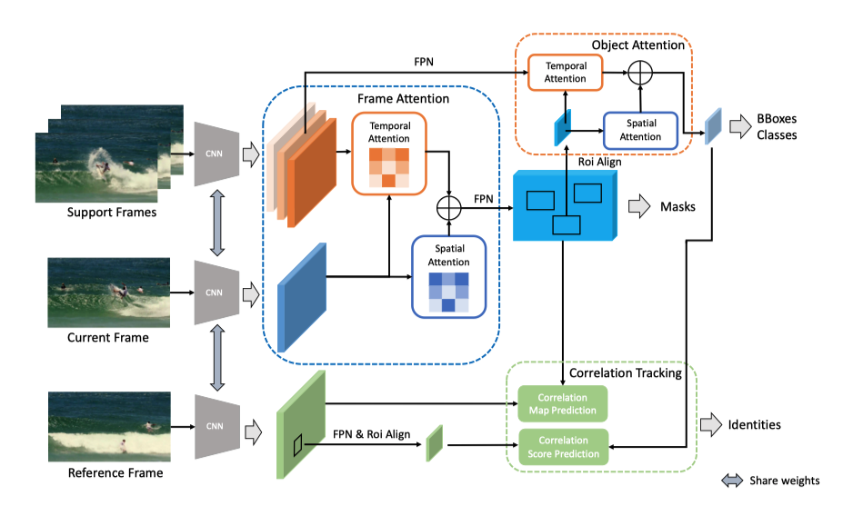

# CompFeat: Comprehensive Feature Aggregation for Video Instance Segmentation

This is the repo to host the code for ComFeat of the following paper:

**CompFeat: Comprehensive Feature Aggregation for Video Instance Segmentation**, AAAI 2021 [ArXiv Link](https://arxiv.org/abs/2012.03400) 

[Yang Fu](http://ifp-uiuc.github.io/), [Linjie Yang](https://scholar.google.com/citations?user=XptEO8oAAAAJ&hl=en), [Ding Liu](https://scholar.google.com/citations?user=PGtHUI0AAAAJ&hl=en), [Thomas S. Huang](http://ifp-uiuc.github.io/) and [Humphrey Shi](https://www.humphreyshi.com).

**Note:**
Our code will be released here, stay tuned.

## Introduction
Video instance segmentation is a complex task in which we need to detect, segment, and track each object for any given video. Previous approaches only utilize single-frame features for the detection, segmentation, and tracking of objects and they suffer in the video scenario due to several distinct challenges such as motion blur and drastic appearance change. 
To eliminate ambiguities introduced by only using single-frame features, we propose a novel comprehensive feature aggregation approach (**ComFeat**) to refine features at both frame-level and object-level with temporal and spatial context information. 
The aggregation process is carefully designed with a new attention mechanism which significantly increases the discriminative power of the learned features.
We further improve the tracking capability of our model through a siamese design by incorporating both feature similarities and spatial similarities.
Our proposed CompFeat achieves the state-of-the-art results on the challenging YouTube-VIS dataset.

## Framework


## Bibtex
```
@article{fu2021compfeat,
  title={CompFeat: Comprehensive Feature Aggregation for Video Instance Segmentation},
  author={Yang Fu, Linjie Yang, Ding Liu, Thomas S. Huang and Humphrey Shi},
  journal={AAAI Conference on Artificial Intelligence},
  year={2021}
}
```
